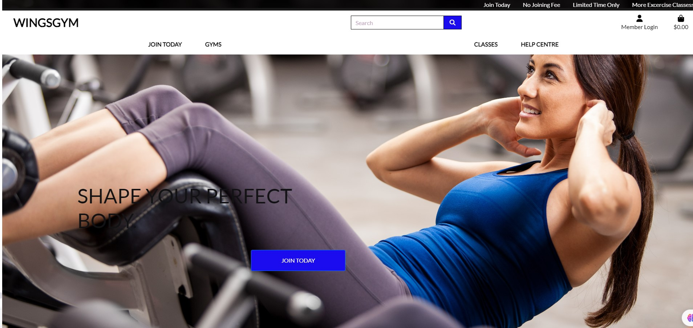
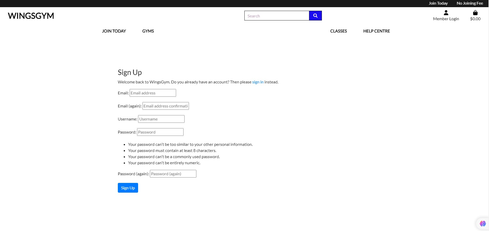
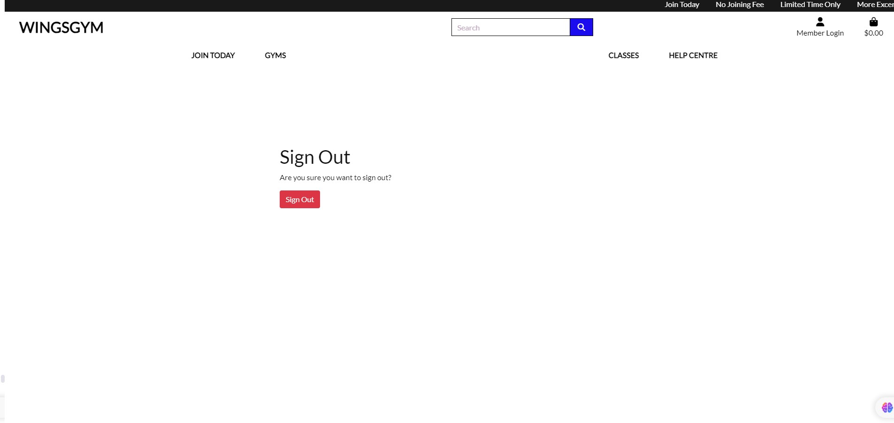
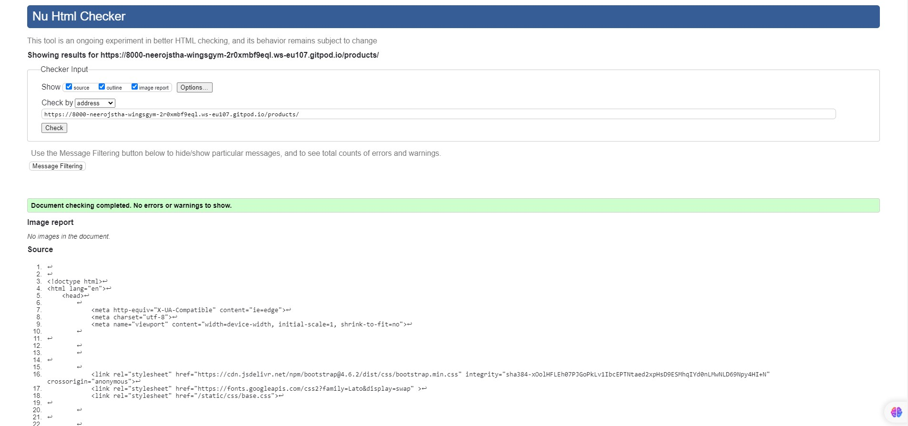
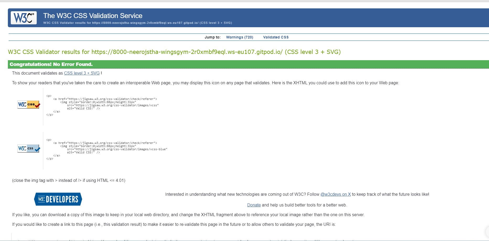

# Wings Gym Website

## Table of Contents

- [Description](#description)
- [Features](#features)
- [User](#user)
- [Demo](#demo)
- [Testing](#testing)
- [Django administration login](#admin)
- [Debug](#debug)
- [Deployment](#deployment)
- [Additional Notes or Future Improvements](#additional)
- [Credits](#credits)

## Description

When creating a description for the "Wings Gym" on a profile page, you want to emphasize its unique features, atmosphere, and the benefits it offers to members. Here's a potential description you might use or adapt:

Welcome to Wings Gym: Your Launchpad to Fitness!

At Wings Gym, we believe in soaring beyond limits. Our state-of-the-art facility is not just a gym; it's a community where each member is encouraged to push boundaries and achieve their personal best. Here's what makes us unique:

Innovative Equipment: From resistance machines to free weights, cardio zones, and functional training areas, our equipment is cutting-edge and well-maintained, ensuring a safe and effective workout every time.

Diverse Classes: Dive into our wide range of classes, including yoga, pilates, Zumba, spin, and HIIT, led by certified instructors passionate about your fitness.

Personal Training: Our experienced trainers are here to craft personalized workout plans that align with your goals, whether you're looking to build muscle, lose weight, or improve overall fitness.

Nutritional Guidance: Understanding that fitness goes beyond the gym, we offer nutritional counseling to complement your workout regime.

Welcoming Community: Wings Gym is more than a place to work out; it's a supportive community. Join fellow members in challenges, social events, and more.

Spa & Recovery: After a hard workout, relax and rejuvenate with our on-site spa services, including massages, saunas, and steam rooms.

Flexible Membership: Choose a plan that fits your lifestyle, with no long-term commitments or hidden fees.

Your Fitness Journey Begins Here!

Whether you're a beginner or a seasoned athlete, Wings Gym is your destination for personal growth and community. Visit us to experience a facility that helps you spread your wings and fly towards your fitness aspirations.

## Features

- Responsive design for seamless user experience on various devices.
- Eye-catching hero section with a call-to-action button.
- Users should find what they're looking for quickly, without confusion or excessive clicks.
- Typical sections include About Us, Services, Class Schedule, Membership Information, Contact, and perhaps a Blog or News section.
- Information on the equipment and amenities available.
- Contact section with a contact form and essential contact details.
- Sticky navigation bar for easy access to different sections of the website.
- The website should be accessible and functional on various devices, including desktops, tablets, and smartphones.

## User

- Signup
user need signup account to modify, view and delete booking.

- Signin
User can view, modify and delete booking after signin.

- Signout
User can signout from the page.

- Stripe payment
User can see payment on stripe dashboard.

## Demo

A live demo of the Cafe Soul Website is available at https://cafe-booking-4d8e2d880209.herokuapp.com/.

## Tesing

- HTML checker
used w3 validator to check error and No error or warning shows.

- CSS checker
Used w3 jigsaw css checker and passed without error.

- Lighthouse Test
Light house test performance, accessiblity, best practices and SEO.

- Testing Process

    During the development of Cafe Soul Website, I paid close attention to the quality of the site. The testing process involved the following steps:

    - **Functionality Testing**: I thoroughly tested all core features of the website, such as menu display, appointment booking, and contact form submission.

    - **Compatibility Testing**: I verified the compatibility of the website across multiple web browsers (Chrome, Firefox, Safari) and various devices (desktop and mobile).

    - **Responsiveness Testing**: The website was rigorously tested for responsiveness on different screen sizes to ensure a seamless experience for all users.

    - **Performance Testing**: Performance analysis tools, including Lighthouse, were used to optimize loading times and resource usage.

    - **Security Testing**: Security measures were implemented, including protection against common web vulnerabilities.

    

    The testing process was an iterative one, and multiple rounds of testing were conducted throughout the development. Any identified issues and bugs were promptly addressed to maintain the website's quality.

## Technologies Used

- HTML5
- CSS3
- JavaScript
- Bootstrap 5
- Django (Python Web Framework)
- PostgreSQL (Database)

## Django administration login

- username: nero26
- password: dublin123

## Debug

Debugging is an essential part of working with Cafe Soul. While we strive to create a smooth user experience, issues may arise from time to time. here are some steps took  diagnose and resolve issues:

1. **Check Documentation**: Refer to the project's documentation or user guide for information on how to use and configure different features of Wings Gym.

2. **Inspect Error Messages**: whenever issues encounter, addressed them and resolved.

3. **Review Code**: reviews the code to correct typos and other errors.

4. **Use Debugging Tools**: avaible debugging tools are used to resolved errors.

5. **Check Dependencies**: Checked all dependencies and function during website building process

6. **Search Issue Tracker**: Used issue tracker to find potential bugs.

7. **Community Support**: Took help from slack coomunity to resolve error during website building time.

## Additional Notes or Future Improvements
    
- Create a member forum or social platform for members to share experiences, challenges, and organize group activities.

- Implement a 'Workout Buddy' system to connect members with similar fitness goals.

- Offer app-exclusive features like barcode entry to the gym, push notifications for class reminders, and workout tracking..

- Offer live-streamed classes for members who can't make it to the gym.

- Integrate AI chatbots for 24/7 basic customer service inquiries.

## Deployment

- This pages are deployed in git heroku and published.
- site link : https://wingsgym-20a4a87d8885.herokuapp.com/

## Credits

- This pages html, css, js, python etc codes are inspired from Boutique Ado project.
- Photos are received from unsplash and google images. 
- Special thanks to my mentor Rahul Lakhanpal for mentoring me during this project.

