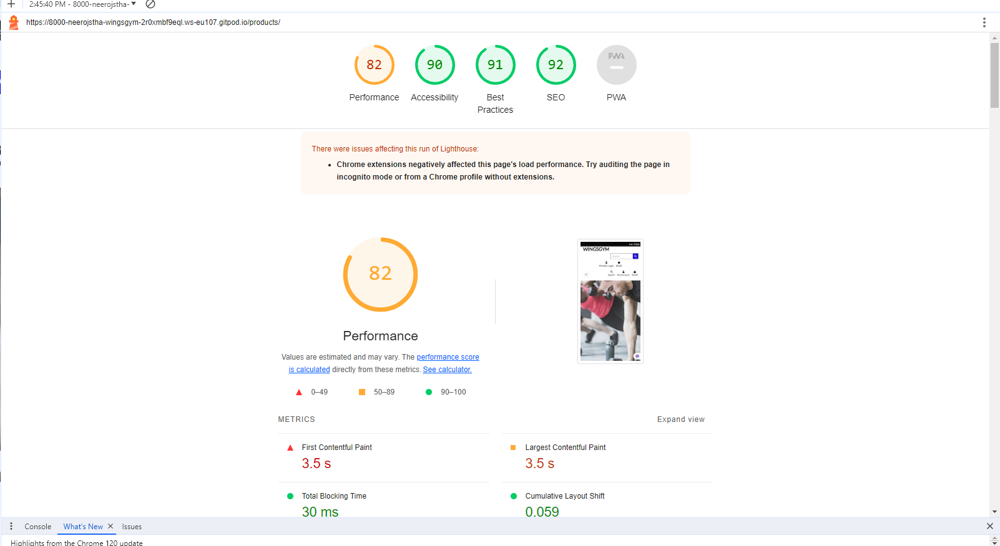

# Wings Gym Website

## Table of Contents

- [Description](#description)
- [Features](#features)
- [User](#user)
- [Demo](#demo)
- [Testing](#testing)
- [Django administration login](#admin)
- [Debug](#debug)
- [Deployment](#deployment)
- [Additional Notes or Future Improvements](#additional)
- [Credits](#credits)

## Description

Wings Gym Website is a modern and user-friendly platform for showcasing the offerings and Packages of Cafe Soul. It aims to provide an attractive online presence for the gym, allowing members to explore the membership, make appointments, and get in touch with the cafe. Additionally, the posts on the website are there to inform customers about the diverse array of foods and coffee, helping them make informed choices and enticing them to visit the cafe to savor the delicious offerings.

## Features

- Responsive design for seamless user experience on various devices.
- Eye-catching hero section with a call-to-action button.
- Informative about section that introduces Cafe Soul's story and vision.
- Menu section to display a range of delectable menu items with images and prices.
- Booking section to book table, see booking time, edit booking time and people and delete booking.
- Contact section with a contact form and essential contact details.
- Sticky navigation bar for easy access to different sections of the website.
- Social media integration for easy access to Cafe Soul's social media profiles.

## User

- Signup
user need signup account to modify, view and delete booking.

- Signin
User can view, modify and delete booking after signin.

- Create Booking
User can create a booking directly through by clicking nav button without login.

- Edit Booking
User can edit booking according user need just to login website with username and password.

- Delete Booking
User can delete booking after login website.

- No Booking
After log in if user don't have booking, system will shows no booking on the screen.

-Superuser
Admin or superuser can create, read, edit and delete booking after login. Superuser can see all the booking list after clciking your booking nav button and can modify according to customer request.

## Demo

A live demo of the Cafe Soul Website is available at https://cafe-booking-4d8e2d880209.herokuapp.com/.

## Tesing

- HTML checker
used w3 validator to check error and No error or warning shows.

- CSS checker
Used w3 jigsaw css checker and passed without error.

- Lighthouse Test
Light house test performance, accessiblity, best practices and SEO.

- Testing Process

    During the development of Cafe Soul Website, I paid close attention to the quality of the site. The testing process involved the following steps:

    - **Functionality Testing**: I thoroughly tested all core features of the website, such as menu display, appointment booking, and contact form submission.

    - **Compatibility Testing**: I verified the compatibility of the website across multiple web browsers (Chrome, Firefox, Safari) and various devices (desktop and mobile).

    - **Responsiveness Testing**: The website was rigorously tested for responsiveness on different screen sizes to ensure a seamless experience for all users.

    - **Performance Testing**: Performance analysis tools, including Lighthouse, were used to optimize loading times and resource usage.

    - **Security Testing**: Security measures were implemented, including protection against common web vulnerabilities.

    

    The testing process was an iterative one, and multiple rounds of testing were conducted throughout the development. Any identified issues and bugs were promptly addressed to maintain the website's quality.

## Technologies Used

- HTML5
- CSS3
- JavaScript
- Bootstrap 5
- Django (Python Web Framework)
- PostgreSQL (Database)

## Django administration login

- username: nero26
- password: dublin123

## Debug

Debugging is an essential part of working with Cafe Soul. While we strive to create a smooth user experience, issues may arise from time to time. here are some steps took  diagnose and resolve issues:

1. **Check Documentation**: Refer to the project's documentation or user guide for information on how to use and configure different features of Cafe Soul.

2. **Inspect Error Messages**: whenever issues encounter, addressed them and resolved.

3. **Review Code**: reviews the code to correct typos and other errors.

4. **Use Debugging Tools**: avaible debugging tools are used to resolved errors.

5. **Check Dependencies**: Checked all dependencies and function during website building process

6. **Search Issue Tracker**: Used issue tracker to find potential bugs.

7. **Community Support**: Took help from slack coomunity to resolve error during website building time.

## Additional Notes or Future Improvements
    
- During the project development, I observed that users were particularly interested in the menu section, spending an average of 3 minutes browsing the available items. This   suggests that the menu plays a central role in user engagement.

- While the current version of Cafe Soul Website is functional and user-friendly, there are several areas that could be improved. We plan to focus on enhancing the user interface to provide a more visually appealing and intuitive experience.

- In the future, we plan to implement a user registration and login system, allowing customers to create accounts, save their favorite menu items, and place orders directly from the website. This will enhance user engagement and convenience.

- I have identified opportunities to optimize the loading speed of the website, especially for images and dynamic content. Implementing these optimizations will lead to faster page load times and improved user satisfaction.

## Deployment

- This pages are deployed in git heroku and published.
- site link : https://cafe-booking-4d8e2d880209.herokuapp.com/

## Credits

- This pages html, css, js, python etc codes are inspired from I THINK THERFORE I BLOG project.
- Photos are received from unsplash and google images. 
- Special thanks to my mentor Rahul Lakhanpal for mentoring me during this project.

